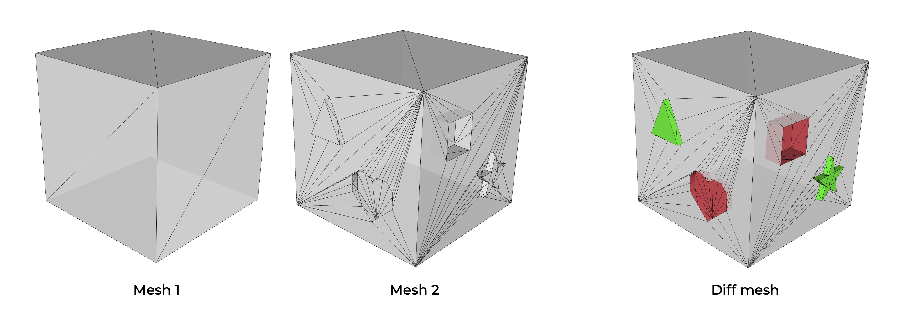

# gitBooleans
<p align="center"></p>

In this project we've been implementing a new way to create a diff meshing algorithm using boolean operators.

# Usage

Clone this repository:
```
git clone https://github.com/micheleFaedda/gitBooleans.git
```
Once done, you may build the executable as follows (put ``Release`` or ``Debug`` instead of ``<build_type>``):

```
mkdir build
cd build
cmake .. -DCMAKE_BUILD_TYPE=<build_type>
make
```

The ***make*** comand produces an executable file:

* ***gitBooleans***: it allows to make the diff between two meshes provided as input (check the code for the command syntax).

We tested our code on MacOS (CLANG 14.0 64 bit), Linux (GCC 7.3.0 64 bit).
## Citing us
This project is based on algorithms described in the following scientific articles. If you use our code in your academic projects, please consider citing our articles using the following BibTeX entries:
```
@article{CPAL22,
title   = {Interactive and Robust Mesh Booleans},
author  = {Cherchi, Gianmarco and Pellacini, Fabio and Attene, Marco and Livesu, Marco},
journal = {ACM Transactions on Graphics (SIGGRAPH Asia 2022)},
year    = {2022},
volume  = {41},
number  = {6},
doi     = {10.1145/3550454.3555460}
}

@article{CLSA20,
title   = {Fast and Robust Mesh Arrangements using Floating-point Arithmetic},
author  = {Cherchi, Gianmarco and Livesu, Marco and Scateni, Riccardo and Attene, Marco},
journal = {ACM Transactions on Graphics (SIGGRAPH Asia 2020)},
year    = {2020},
volume  = {39},
number  = {6},
doi     = {10.1145/3414685.3417818}
}

@article{LCSA21,
title   = {Deterministic Linear Time Constrained Triangulation using Simplified Earcut},
author  = {Livesu, Marco and Cherchi, Gianmarco and Scateni, Riccardo and Attene, Marco},
journal = {IEEE Transactions on Visualization and Computer Graphics (TVCG)},
year    = {2022},
volume  = {28},
number  = {12},
doi     = {10.1109/TVCG.2021.3070046}
}
```